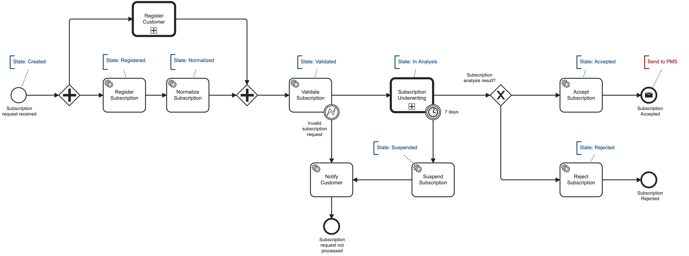
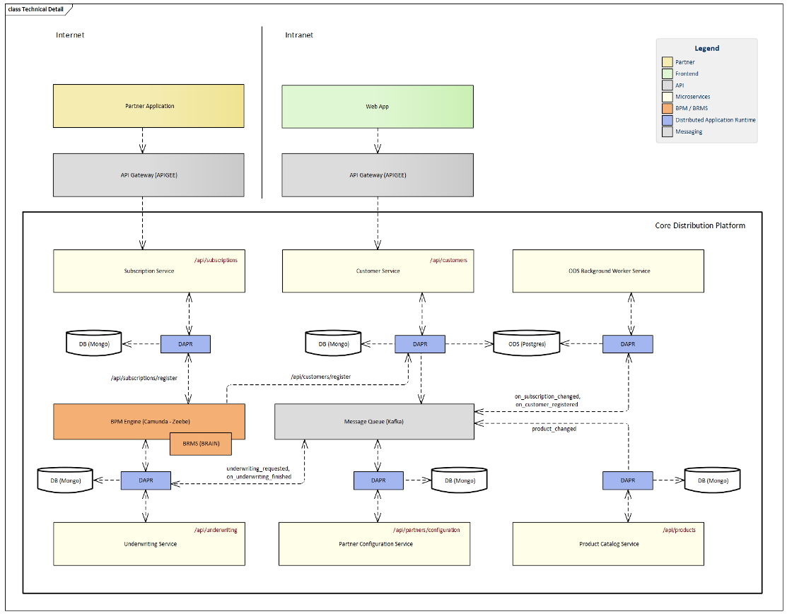
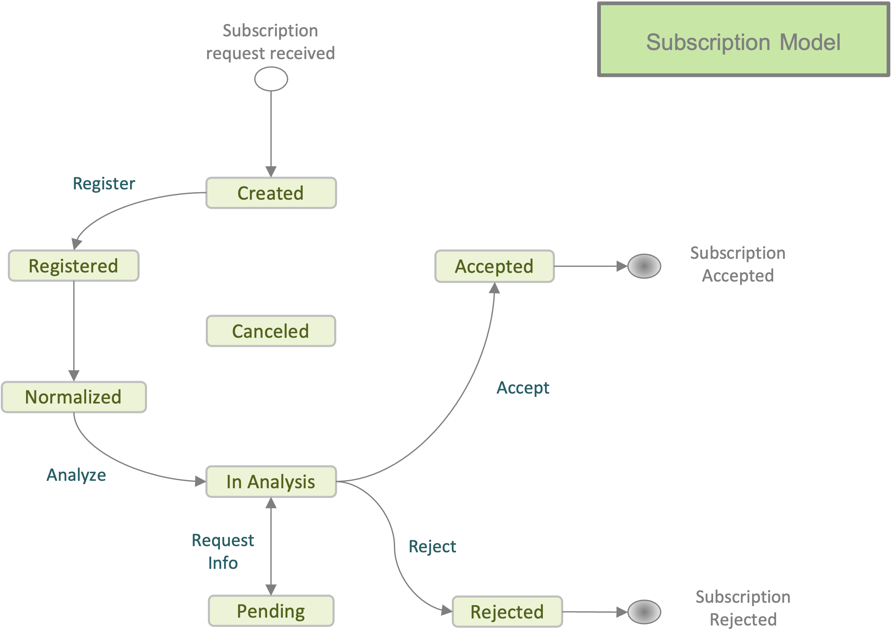
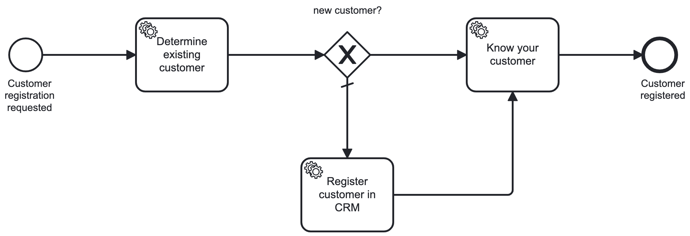
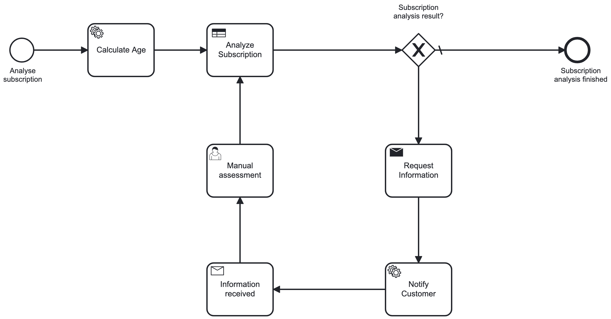
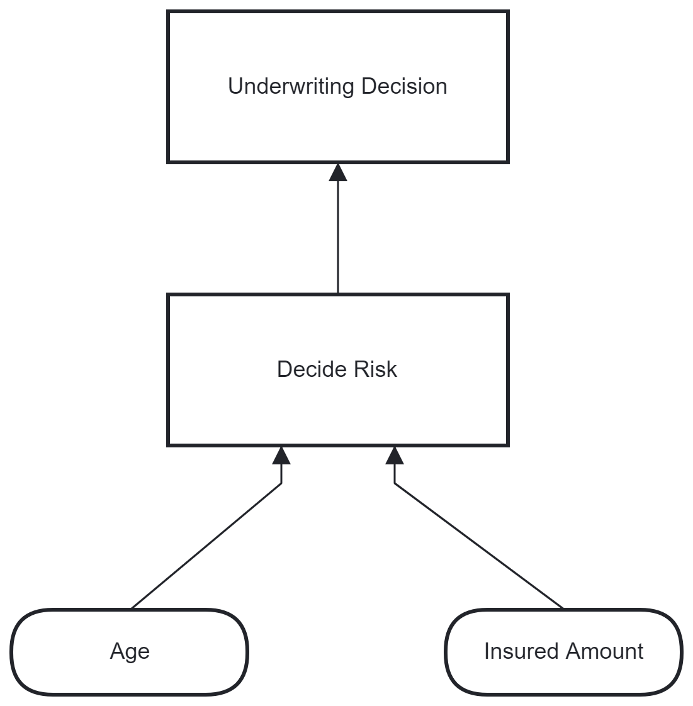
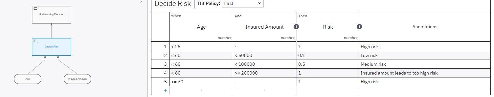

# Processing Subscription demo

Lets assume that we want to process subscriptions (subscription becomes policy) and split processing into mulitple microservices. 
There are possibly many ways how to achieve the goal. A typical approach is use some message oriented middleware like Kafka or RabbitMQ
and exchange messages. While this is perfectly acceptable the other approach is to use some workflow orchestrator, in our case Camunda Platform 8.
The BPMN below describes the flow.



The first task is to register a customer in CRM system or - in our case - Customer Service.
Then Subscription Service is responsible for registering and validating the request.
Assessment of incoming subscription can be implemented in DMN tables or in a more sophisticated way 
using custom Underwriting Service. After acceptance the subscription is sent to PMS (policy management system) 
for further processing and activation. This part is outside of this scope.

## Architecture

For high availability systems I've decided to split commands and queries. 
Each microservice has its own data store, but to provide the full visibility on customer we need to build simple ODS 
(operational data store) which will be responsible for aggregating all customer portfolio and display a list of policies 
or status of raised claims in future.

Camunda orchestrates all the microservices and drives the asynchronous flow. The same approach could be achieved using 
messaging (Kafka, RabbitMQ, ...) however here we have long running process support with full visibility out of the box.



## The process

1. Subscription API is responsible to accept any subscription request and triggers processing in Camunda. 
ProcessInstanceKey is given back as a reference.
2. Register Customer and Register Subscription runs in parallel.
3. Register Subscription in ODS - purpose is to generate read only model for customer queries.
4. Validate Subscription - semantic validation happens here. If something is missing, customer will be notified and 
subscription becomes Suspended. ODS is updated with the actual state.
5. Subscription Underwriting - assessment of the risk according to customer age and insured amount. 

Subscription And Customer Model

Both Subscription and Customer models are implemented using domain driven design. 
To be able to properly serialize objects to database the easiest approach is map to simple POCO objects.
I'm not a big fan of auto-mappers, but here it may be quite useful for one-way mapping.



### Register Customer



## Validate Subscription

Ensure semantic validation of incoming subscription. For instance, here it validates that the product is available for sales.

## Underwriting process

Given customer's age and insured amount decide risk and make a final decision whether to accept subscription request.
Since age needs to be calculated first, it's set as output parameter from "Create customer in CRM" activity and then
available in global scope for other tasks.

### Analyze Subscription



The following diagram consists of 2 decisions and shows how to chain multiple steps into a final one. 



First, decide risk according to customer age and insured amount results to 0-1.



Second, make a final decision according to the risk evaluated.

---

## Setup

| Service                   | Application Port | Dapr sidecar HTTP port | Dapr sidecar gRPC port | Metrics port |
|---------------------------|------------------|------------------------|------------------------|--------------|
| SubscriptionService       | 5001             | 3601                   | 60001                  | 9091         |
| CustomerService           | 5002             | 3602                   | 60002                  | 9092         |
| UnderwritingService [tbd] | 5003             | 3603                   | 60003                  | 9093         |
| PartnerService [tbd]      | 5004             | 3604                   | 60004                  | 9094         |
| ProductService [tbd]      | 5005             | 3605                   | 60005                  | 9095         |
| ODSService                | 5010             | 3610                   | 60010                  | 9100         | 

---

### Builds

```terminal
docker build -f ./services/CustomerService/Dockerfile .
docker build -f ./services/SubscriptionService/Dockerfile .
docker build -f ./services/ODSService/Dockerfile .
```

### Run & test

```terminal 
docker compose --env-file .env -f docker-compose-camunda.yaml up -d
docker compose --env-file .env -f docker-compose-infra.yaml up -d
docker compose -f docker-compose.yaml up -d
```

Apply scripts in "scripts" folder which contains migrations in numbered order.
The other approach is to use `dotnet ef database update` command, but first 2 must be run anyway.


File requests.http contains REST client scripts and is perhaps better.

```
POST http://localhost:5001/api/subscriptions
dapr-app-id: subscription-service
content-type: application/json

{
  "firstName": "Homer",
  "lastName": "Simpson",
  "email": "homer.simpson@thesimpsons.movie",
  "birthDate": "01-01-2000",
  "productId": "1",
  "loanAmount": 200000,
  "insuredAmount": 100000
}
```

and check subscription state:

```
GET http://localhost:5001/api/subscriptions/{subscriptionId}
```

### Notes

Camunda Platform 8 supports many connectors our of the box, but I prefer to leave the work on microservice 
where Dapr does a great job to subscribe events. 

Please note that it's just a demo. 
Typically underwriting happens even before any binding offer.