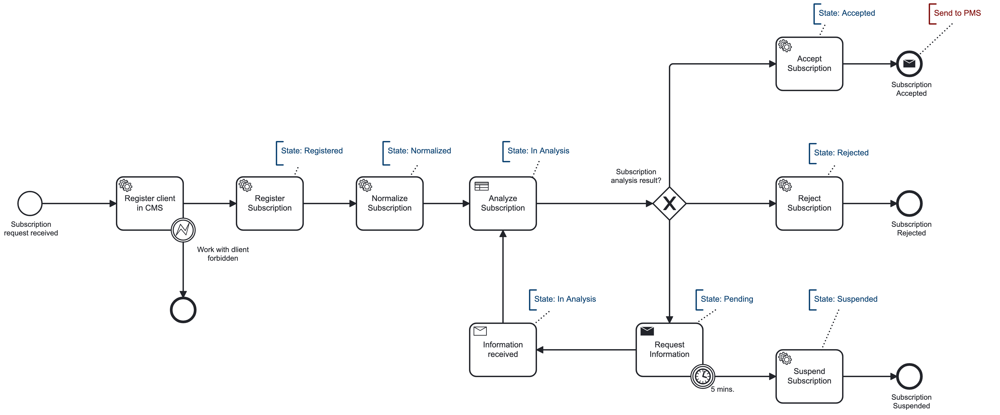
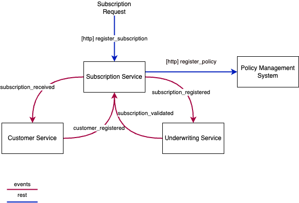

[](https://github.com/RobertVejvoda/dapr-zeebe-demo/actions/workflows/docker-image.yml)

# Processing Subscription demo

Lets process and validate incoming subscriptions by exposing microservice APIs and bind them events.



## Architecture


## Subscription Model


## Events / topics



## Subscription validation - underwriting process


---

## Run

### Self hosted

| Service                   | Application Port | Dapr sidecar HTTP port | Dapr sidecar gRPC port | Metrics port |
|---------------------------|------------------|------------------------|------------------------|--------------|
| SubscriptionService       | 5001             | 3601                   | 60001                  | 9091         |
| CustomerService           | 5002             | 3602                   | 60002                  | 9092         |
| UnderwritingService [tbd] | 5003             | 3603                   | 60003                  | 9093         |
| PartnerService [tbd]      | 5004             | 3604                   | 60004                  | 9094         |
| ProductService [tbd]      | 5005             | 3605                   | 60005                  | 9095         |

Install Dapr and initialize in local environment: https://docs.dapr.io/getting-started/install-dapr-selfhost/

`dapr init`

Expected output:

- dapr_placement container is running.
- dapr_redis container is running.
- dapr_zipkin container is running.

If the placement service is not running, it can't bind zeebe and other components. This can happen if initialized
via `dapr init -slim` command.

Run dapr dashboard (optional) on port 8090, because Camunda is already occupying default port
8080: `dapr dashboard -p 8090`

If port is already allocated, find process and kill:

```
lsof -i tcp:5056
kill 2309
```

In fact, only the placement service is needed here, so Dapr can be initialized as `dapt init --slim`.

---

### Docker

Ensure worker files in dapr/components folder use host.docker.internal instead of localhost.

Run app: `docker compose -f docker-compose.yaml up --build`

### Kubernetes

To be able to push and pull build images, 
run local registry: `docker run -d -p 6000:5000 --restart=always --name registry registry:2`

#### Dapr on Kubernetes

`dapr init -k`
`kubectl get pods --namespace dapr-system`

Ensure content in %USERPROFILE%\.dapr\

Deploy to K8s: `helm install onecop`

Execute start.ps1 in Deploy/k8s/kubectl 

#### Metrics

Follow https://docs.dapr.io/operations/observability/metrics/

### Tests

Depends on how it's run, change host.docker.internal to localhost in dapr/components folder and run in
terminal: `dotnet run`. Dapr sidecar is automatically attached to the process.

File requests.http contains REST client scripts and is perhaps better. I added a process version for each script as I
believe it's a good rule.

Run app first: `dotnet run`

Run in another terminal - register subscription

```
POST http://localhost:5001/api/subscriptions
dapr-app-id: subscription-service
content-type: application/json

{
  "firstName": "Homer",
  "lastName": "Simpson",
  "email": "homer.simpson@thesimpsons.movie",
  "age": 30,
  "productId": "1",
  "loanAmount": 200000,
  "insuredAmount": 100000
}
```

and validate

```
GET http://localhost:5001/api/subscriptions/{subscriptionId}
```

### Notes

Content type MUST be specified in header: `curl -H "Content-Type: application-json" ...`

For running locally dapr-app-id must be specified in header: `curl -H "dapr-app-id: customer-service" ...`

Return type of the message is passed back to global scope of Camunda variables:


### Builds and Deployments

I'm using Docker buildx by default for multi-platform builds to support both platforms - linux/amd64 and linux/arm64.

```terminal
docker buildx build --pull --push -t localhost:6000/customer-service -f ./CustomerService/Dockerfile --platform linux/arm64,linux/arm,linux/amd64 .
docker buildx build --pull --push -t localhost:6000/subscription-service -f ./SubscriptionService/Dockerfile --platform linux/arm64,linux/arm,linux/amd64 .
```

### Minikube and store images in insecure registry

```terminal
minikube start --insecure-registry "10.0.0.0/24"  
minikube addons enable registry
minikube addons enable dashboard  
minikube addons enable metrics-server 
docker run --rm -it --network=host alpine ash -c "apk add socat && socat TCP-LISTEN:5000,reuseaddr,fork TCP:$(minikube ip):5000
docker tag customer-service:latest localhost:5000/customer-service:latest
docker push localhost:5000/customer-service:latest 
docker tag subscription-service:latest localhost:5000/subscription-service:latest
docker push localhost:5000/subscription-service:latest 
```
