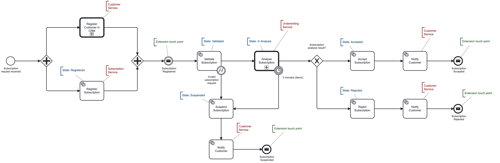

# Processing Subscription demo

Purpose of this project is show how to implement microservices with Dapr and Camunda in larger scope. The following BPMN
diagram shows one of many possible ways how to register request for mortgage cover, 
validate it and process into Policy Management System (out of scope). 



## Architecture


**Customer Zone (web UI)** is a simple application in Blazor to send and display subscription requests.
It only communicated with APIs which are exposed in Customer Experience API. I had to try [Refit](https://github.com/reactiveui/refit)
which is automatic type-safe REST library for .net core.   

Each microservice has its own responsibility and data store. Subscription behaviour is implemented using domain driven approach 
and can only be in valid states. The object is serialized and saved into MongoDB statestore using Dapr.

**Microservices**

1. Customer Experience API - .net8 based microservice which IS exposed. It has MSSQL container for registered requests.
2. Subscription Service - .net8 based microservice which should NOT be exposed (only internal)
3. Customer Service - .net based microservice which should NOT be exposed (only internal)

The architecture follows (kind of) CQRS pattern, when all read requests go only to Customer Experience API.

## The process

1. When Customer Exp. API receives a request, it triggers the process in Camunda and returns process identificator (ProcessInstanceKey).
This key is used as a primary key for all requests. 
2. Camunda starts processing and calls job workers. These are defined in Dapr as Zeebe job workers and bind microservice endpoints.
3. The first task is to register a customer in CRM system. That's Customer Service responsibility.


4. In parallel we register the subscription in Subscription Service. Once both tasks are finished, there is an extension endpoint. 
Purpose of the endpoint is to notify listeners (Customer Exp. API) about Subscription status. Other endpoints are after Subscription status is changed.
5. Subscription is validated, for example the requested product is still active.
6. Provide medical assessment, calculate risk and possibly request more information. A DMN table handles the risk evaluation.


The following diagram consists of 2 decisions and shows how to chain multiple steps into a final one.
First, decide risk according to customer age and insured amount results to 0-1.


7. As a result of analysis the subscription will be accepted, rejected or suspended. State machine diagram shows the full subscription lifecycle.


---     

## Setup

| Service                      | Application Port | Dapr sidecar HTTP port | Dapr sidecar gRPC port | Metrics port |
|------------------------------|------------------|------------------------|------------------------|--------------|
| SubscriptionService          | 5001             | 3601                   | 60001                  | 9001         |
| CustomerService              | 5002             | 3602                   | 60002                  | 9002         |
| Customer Experience API      | 5010             | 3610                   | 60010                  | 9010         |
| CustomerWeb                  | 5100             |                        |                        |              |

---

### Run

Apply migrations: `dotnet ef database update`.

```terminal 
docker compose --env-file .env -f docker-compose-camunda.yaml up -d
docker compose --env-file .env -f docker-compose-infra.yaml up -d
docker compose -f docker-compose.yaml up -d --build
```

### Test

_subscription-requests.http contains calls to handle subscription. Start here to send a new request. The other approach is to use UI. 

_customer-requests.http contains testable customer-register.bpmn process as a separate feature.

_camunda-requests.http contains some direct Zeebe commands, like publish-message to simulate response from customer when subscription is in "Pending" state.

---

1. Navigate to http://localhost:5100 and trigger request in UI or trigger requests in .http files.
2. See processing running Operate on http://localhost:8081 with demo/demo credentials.
3. See tasklist on http://localhost:8082 with demo/demo credentials.
4. See mailbox simulating customer notifications on http://localhost:4000.
5. See zipkin traces on http://localhost:9412.


---

### Requests

As an example the following requests are used for testing.

**Register Subscription**

```
POST http://localhost:5010/api/subscriptions/register
accept: application/json
content-type: application/json

{
  "firstName": "Homer",
  "lastName": "Simpson",
  "email": "homer.simpson@thesimpsons.movie",
  "birthDate": "1976-01-06",
  "productId": "1", 
  "loanAmount": 200000,
  "insuredAmount": 100000
}

```

and check subscription state providing ProcessInstanceKey from last step

```
GET http://localhost:5010/api/subscriptions/{{processInstanceKey}}
accept: application/json
content-type: application/json
```

---

**Register customer**

```
POST http://localhost:5010/api/customers/register
Accept: application/json
Content-Type: application/json

{
  "firstName": "Homer",
  "lastName": "Simpson",
  "birthDate": "1976-01-06",
  "email": "homer.simpson@thesimpsons.movie"
}
```

### Notes

Camunda Platform 8 supports many connectors our of the box, but I prefer to leave the work on microservice 
where Dapr does a great job to subscribe events. 

Please note that it's just a demo. 
Typically underwriting happens even before any binding offer.

### Known issues

1. Error: <i>"cannot parse variables from binding result ; got error unexpected end of JSON input"</i>

... is caused by method not providing any response.

_Example_

```csharp
[HttpPost("/subscription-registered")]
public async Task<ActionResult> OnSubscriptionRegistered(
    [Required] SubscriptionRegisteredCommand command)
{
    var subscription = await dataContext.FindAsync<SubscriptionRequestEntity>(command.ProcessInstanceKey);
    if (subscription == null)
        return NotFound();

    subscription.SubscriptionId = command.SubscriptionId;
    subscription.SubscriptionState = command.SubscriptionState;
    subscription.LastUpdatedOn = dateTimeProvider.Now();

    await dataContext.SaveChangesAsync();
    
    return Ok();   // <-- issue
}
```

The fix is easy, just return something like 

```csharp
return Ok(new { subscription.SubscriptionId, subscription.LastUpdatedOn });
```

---

2. Error: <i>cannot parse variables from binding result 48; got error json: cannot unmarshal number into Go value of type map[string]interface {}</i>

```csharp
public ActionResult<int> CalculateAge([Required] CalculateAgeCommand command)
        => Ok(Calculator.CalculateAge(command.BirthDate));
```

The fix is easy, just return object

```csharp
public ActionResult<int> CalculateAge([Required] CalculateAgeCommand command)
        => Ok(new { Age = Calculator.CalculateAge(command.BirthDate) });
```


### Disclaimer

It's just a demo and is not a valid insurance business process. The purpose is only to see microservices orchestration by Camunda.